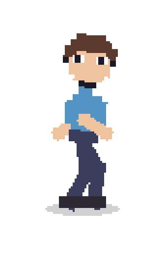
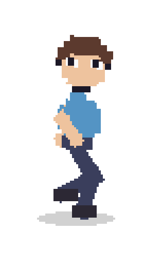
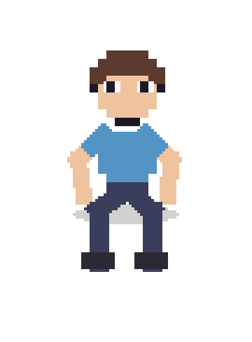
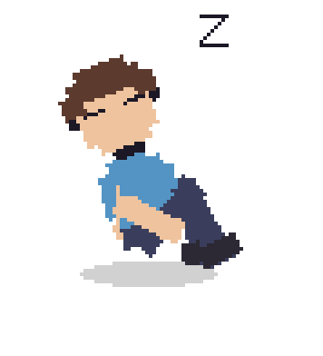
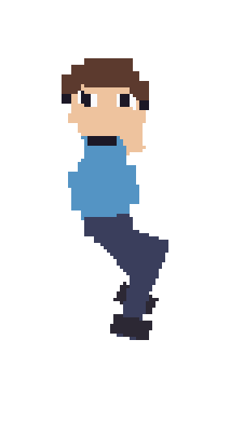

# DeskBuddy

> A tiny pixel-art roommate for your Windows taskbar.

Buddy walks the taskbar, climbs real window edges, perches on title bars, and
takes the occasional nap. Catch him and throw him to send him into full
ragdoll mode: he bounces, tumbles, gets briefly stunned, then pulls himself
together and carries on. Sneak the cursor toward him and he gets wary; rush
him and he runs for it.

## Buddy At Work

| Idle | Walking | Perched |
| :--: | :--: | :--: |
|  |  |  |

| Napping | Window climbing |
| :--: | :--: |
|  |  |

| Alien abduction |
| :--: |
|  |

## Get Him Running

```powershell
pip install PySide6
python deskbuddy.py
```

Buddy appears on the primary monitor, standing on the taskbar.

## Play

| Do this | Buddy does this |
| --- | --- |
| Left-click and drag | Grab and throw him into ragdoll mode |
| Double-click | Jump |
| Move the cursor slowly toward him | Get wary and back away |
| Rush the cursor at him | Panic, sprint, and possibly wipe out |
| Drag a wallpaper selection over him | Get caught in an alien tractor beam until release |
| Right-click | Sit, nap, toss, toggle window perching, or quit |
| Tray icon | Toggle cursor fright or quit if he gets stuck |

## Make It Yours

The `CONFIG` block in [deskbuddy.py](deskbuddy.py) has the useful knobs:
`SCALE` changes Buddy's size, `PALETTE` changes his clothes, and
`SPOOK_ENABLED` controls the cursor-fright behavior.

## Lost Buddy?

On launch, [deskbuddy_log.txt](deskbuddy_log.txt) records Buddy's screen size
and taskbar walking line. If he is still missing, enable `DEBUG_OUTLINE` in
the config block or run:

```powershell
python deskbuddy.py --debug
```

## Small Print

The overlay is click-through except for Buddy himself, so the rest of the
desktop stays usable. He follows resolution and taskbar changes at runtime.
Fullscreen exclusive games draw over him; that is expected.
